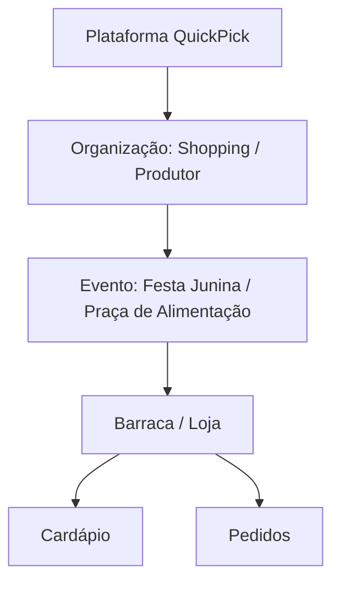

# 🚀 QuickPick - Plano de Startup & Arquitetura
*Sistema para eliminação de filas físicas em quiosques, praças de alimentação e eventos.*

---

## 🎯 1. Visão Geral e Problema

O **QuickPick** (anteriormente FilaZero) é uma aplicação PWA responsiva (Web/Mobile) projetada para eliminar filas físicas em locais de alto fluxo como shoppings, festivais, feiras e festas juninas.

### **Problema que resolve:**
*   Eliminar o tempo de espera em pé em filas.
*   Acabar com a incerteza de quando o pedido ficará pronto.
*   Otimizar a operação de venda e entrega de alimentos.

---

## 👥 2. Fluxos de Navegação

### **📱 Usuário Final**
1.  **Escaneia QR Code** fixado na barraca/quiosque (ou na mesa).
2.  **Acessa Menu Digital** (Nome, Avaliações, Tempo de Preparo, Cardápio com Fotos).
3.  **Seleciona Itens** e adiciona ao carrinho.
4.  **Finaliza Pedido** e realiza o pagamento (Online ou na Retirada).
5.  **Acompanha Status** (*Recebido → Em preparo → Pronto*).
6.  **Interação (Se em Mesa):** Botão **"Chamar Garçom"** para assistência no local.
7.  **Recebe** na mesa (Modo Garçom) ou retira no balcão.

### **🏪 Vendedor / Barraca**
*   **Painel Administrativo:** Gestão de cardápio.
    *   *Recurso IA (Add-on):* Inteligência Artificial para melhorar automaticamente fotos tiradas do produto antes de publicar (ajuste de fundo, brilho, foco).
*   **Gestão de Ordens:** Visualização da fila virtual e alteração de status em tempo real.
*   **Analytics:** Métricas de vendas e tempo de preparo.

### **🤵 Modo Garçom (Opcional por Loja)**
*   **Tela dedicada:** Garçons visualizam pedidos prontos e qual **Mesa** devem servir.
*   **Alerta de Chamada:** Recebem notificações em tempo real com o número da mesa quando o cliente clona o botão "Chamar Garçom".

---

## 🧱 3. Hierarquia do Sistema (Multi-Tenant)

O sistema é estruturado em níveis para suportar múltiplos eventos e organizações isoladamente.



### **Níveis de Acesso (RBAC):**
*   **`platform_admin` (Você):** Controle global de eventos, faturamento e comissões.
*   **`organization_admin`:** Controla o evento (ex: Shopping ou Escola) e cria as barracas.
*   **`vendor`:** Controla o cardápio e lida com os pedidos da barraca.
*   **`waitstaff` (Garçom):** Acessa tela de entregas de mesa e alertas.
*   **`customer`:** Usuário final que realiza e acompanha os pedidos.

---

## 🛠️ 4. Arquitetura e Roadmap Técnico

### **Stack Recomendada**
*   **Frontend:** Next.js (PWA) ou React + Vite (Mobile-First).
*   **Backend & DB:** **Supabase** (PostgreSQL, Realtime, Auth, Storage).
*   **Pagamentos:** Mercado Pago (ideal para Brasil) ou Stripe.
*   **Deploy:** Vercel.

### **Roadmap (MVP - 4 Semanas)**
*   **Semana 1:** Setup (Next.js + Supabase), Modelagem de Banco.
*   **Semana 2:** Autenticação (Roles), Painel do Vendedor Básico.
*   **Semana 3:** Cardápio Digital, Geração de QR Code, Fluxo de Pedido.
*   **Semana 4:** Pagamentos integrados, Notificações Realtime, Teste Piloto.

---

## 🗄️ 5. Modelo de Banco de Dados (SQL Supabase)

### **Estrutura de Tabelas**

```sql
-- 1. Usuários (Perfil)
create table public.users (
  id uuid primary key references auth.users(id) on delete cascade,
  name text,
  phone text,
  role text default 'customer', -- platform_admin, org_admin, vendor, customer
  created_at timestamp default now()
);

-- 2. Organizações (Shoppings, Universidades, etc)
create table organizations (
  id uuid primary key default gen_random_uuid(),
  name text not null,
  created_by uuid references public.users(id),
  created_at timestamp default now()
);

-- 3. Eventos
create table events (
  id uuid primary key default gen_random_uuid(),
  organization_id uuid references organizations(id) on delete cascade,
  name text not null,
  location text,
  start_date timestamp,
  end_date timestamp,
  active boolean default true,
  created_at timestamp default now()
);

-- 4. Vendedores (Barracas/Lojas)
create table vendors (
  id uuid primary key default gen_random_uuid(),
  event_id uuid references events(id) on delete cascade,
  name text not null,
  description text,
  logo_url text,
  average_prep_time integer default 10,
  payment_mode text default 'prepaid', -- prepaid, pay_on_pickup, optional
  accept_cash boolean default true,
  accept_pix boolean default true,
  accept_card boolean default true,
  active boolean default true,
  created_at timestamp default now()
);

-- 5. Itens do Cardápio
create table menu_items (
  id uuid primary key default gen_random_uuid(),
  vendor_id uuid references vendors(id) on delete cascade,
  name text not null,
  description text,
  price numeric(10,2),
  image_url text,
  available boolean default true,
  created_at timestamp default now()
);

-- 6. Pedidos
create table orders (
  id uuid primary key default gen_random_uuid(),
  user_id uuid references public.users(id),
  vendor_id uuid references vendors(id),
  status text default 'received', -- received, preparing, almost_ready, ready, delivered
  payment_status text default 'pending', 
  total_price numeric(10,2),
  pickup_code text,
  table_number text, -- Núm da mesa (para Modo Garçom)
  created_at timestamp default now()
);

-- 8. Chamadas de Garçom (Alertas)
create table waiter_calls (
  id uuid primary key default gen_random_uuid(),
  vendor_id uuid references vendors(id),
  table_number text not null,
  status text default 'pending', -- pending, attended
  created_at timestamp default now()
);

-- 7. Itens do Pedido
create table order_items (
  id uuid primary key default gen_random_uuid(),
  order_id uuid references orders(id) on delete cascade,
  menu_item_id uuid references menu_items(id),
  quantity integer,
  price numeric(10,2)
);
```

> **💡 Nota de Segurança:** O Row Level Security (RLS) do Supabase garantirá que Clientes vejam apenas seus pedidos e Vendedores vejam apenas a fila de sua barraca.

---

## 💰 6. Modelo de Negócio e Monetização

A flexibilidade do sistema permite múltiplos modelos:

*   **Eventos Pontuais (Festas/Feiras):** Taxa fixa por evento + Comissão percentual por pedido (ex: 5%).
*   **Operações Contínuas (Shoppings/Universidades):** Assinatura mensal SaaS (ex: R$ 299/mês por loja).
*   **Upgrade Premium:** Dashboard de analytics avançado e ferramentas de CRM.
*   **Add-on de IA (Cobrado à Parte):** Ativação do módulo de IA para aperfeiçoar fotos de produtos (cobrado por foto ou pacote).
*   **Módulo Garçom:** Taxa extra para habilitar gestão de mesas e chamadas em tempo real.

---

## 🚀 7. Estratégia e Diferenciais

### **Diferencial Competitivo:**
*   **Tempo Estimado Inteligente:** Cálculo dinâmico baseado no volume de pedidos da barraca (`fila * tempo_médio`).
*   **Flexibilidade Operacional:** O vendedor decide se o pagamento é online, na entrega ou opcional.
*   **Foco Regional/Local:** Muito mais leve e rápido que apps de delivery tradicionais (Sem download obrigatório).

### **Plano de Lançamento (Go-to-Market):**
1.  **Festa Junina Escolar / Universitária:** Perfeito para validação de baixo risco.
2.  **Feiras Gastronômicas Locais:** Testar escalabilidade com volume concentrado.
3.  **Praça de Alimentação de Shopping Pequeno:** Iniciar modelo de recorrência.
